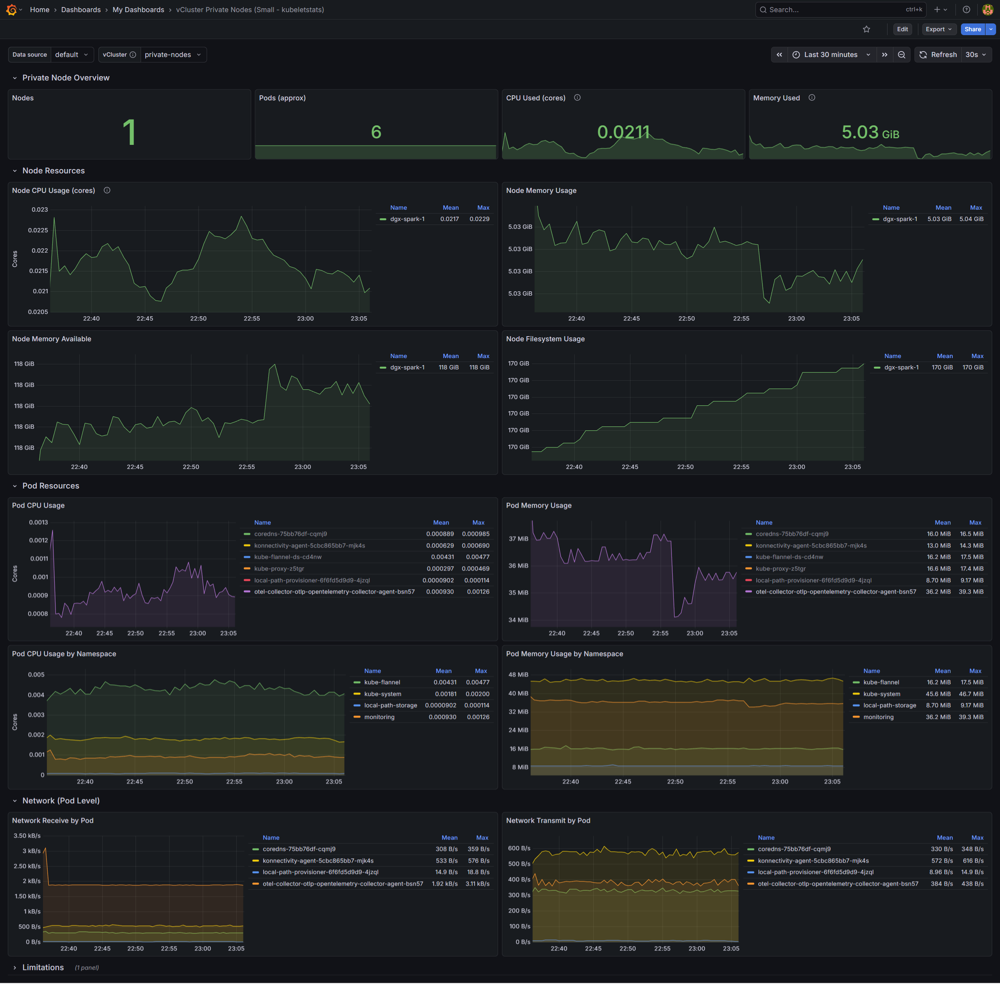
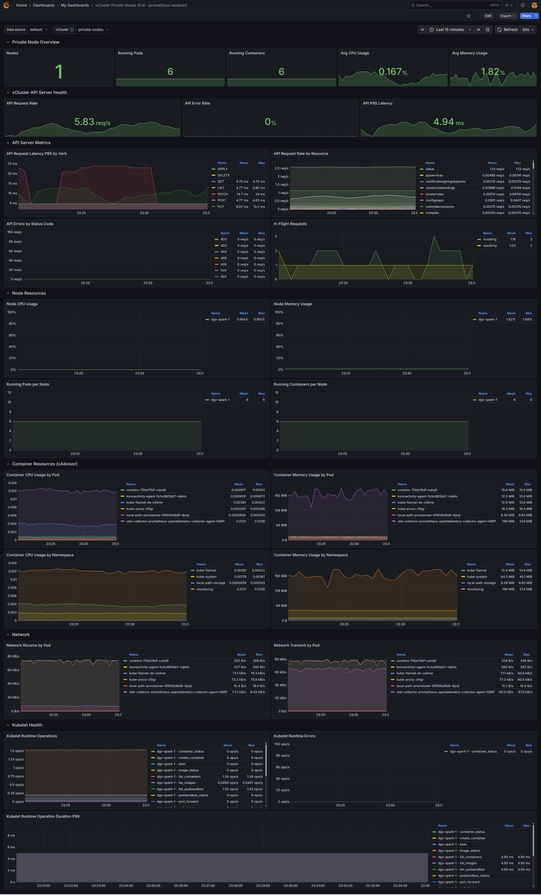

# vCluster Private Node Monitoring

vCluster Platform Apps and Grafana dashboards for monitoring vclusters with private nodes.

## Apps

| App | Description | Metrics Format |
|-----|-------------|----------------|
| `vmagent-app.yaml` | VictoriaMetrics Agent as DaemonSet | Prometheus |
| `otel-collector-prometheus-app.yaml` | OTEL Collector with Prometheus receiver | Prometheus |
| `otel-collector-otlp-app.yaml` | OTEL Collector with kubeletstats receiver | OTel (k8s_*) |

## Dashboards

| Dashboard | Metrics Source | Coverage |
|-----------|---------------|----------|
| `vcluster-prv-dashboard-big.json` | Prometheus format (vmagent, otel-prometheus) | Full: kubelet, cAdvisor, API server |
| `vcluster-prv-dashboard-small.json` | OTel format (otel-otlp) | kubeletstats only |

### OTel Dashboard

### Prometheus Dashboard

## Notes

- Apps deploy as DaemonSets with local-only node scraping (each pod scrapes only its own node)
- Loft labels (`cluster`, `loft_project_name`, `loft_virtualcluster_name`, `loft_user_name`) are automatically added
- Prometheus must have `enableRemoteWriteReceiver: true` for remote write apps
